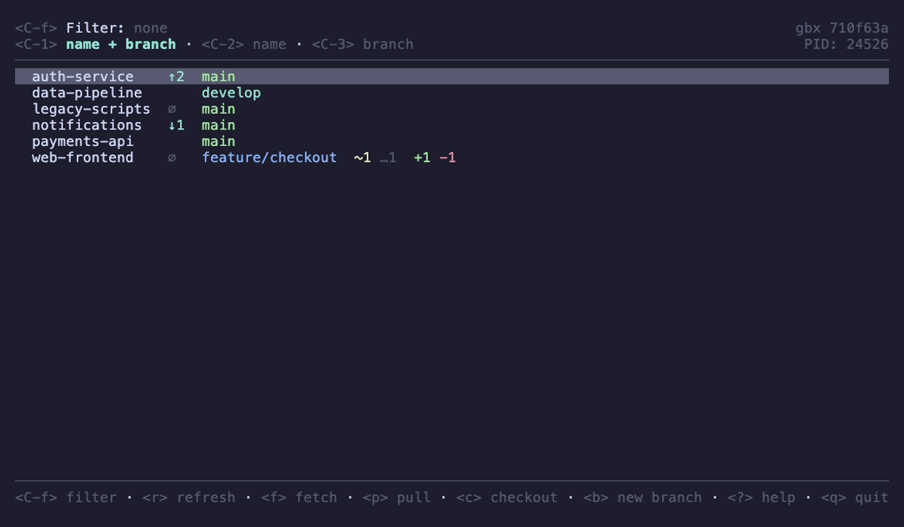
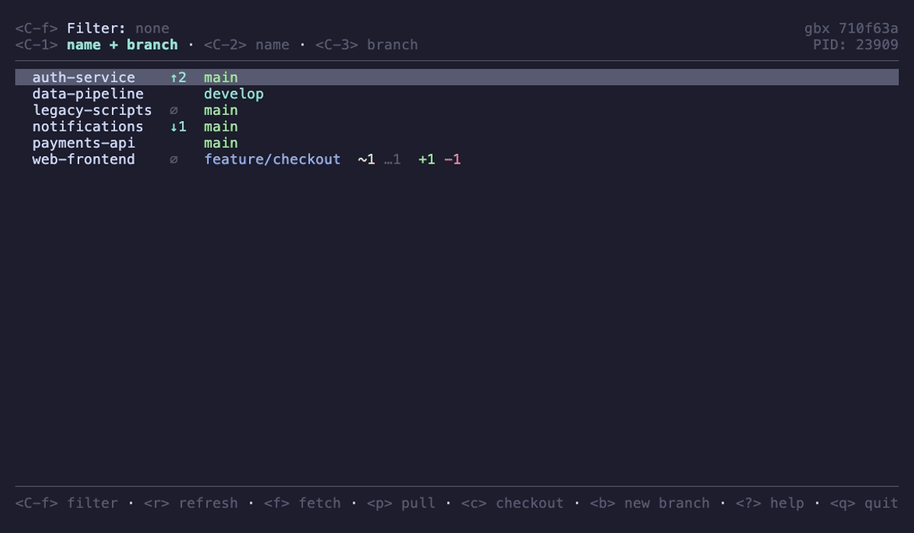
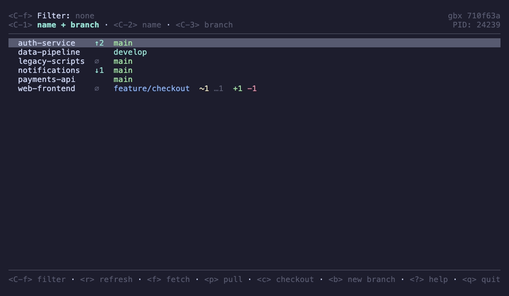
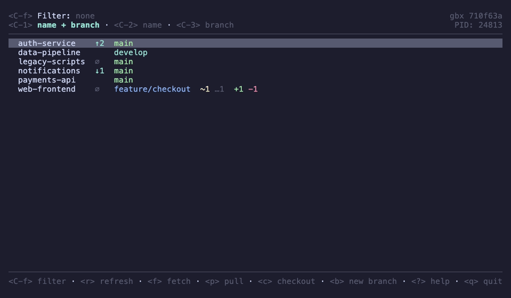

# gbx

Manage your fleet of git repos with a pretty TUI.

[](https://github.com/deemson/gbx/actions/workflows/ci.yml)
[](https://github.com/deemson/gbx/releases/latest)
[](https://pkg.go.dev/github.com/deemson/gbx)
[](LICENSE)



`gbx` (**g**it **b**atch e**x**ecutor) is a terminal UI for everyone juggling a
directory full of git checkouts — microservices, monorepo siblings, a folder of
cloned projects. It shows the branch, ahead/behind, and dirty state of every
repo at once, lets you filter the list with an fzf-style query, and runs a fixed
set of non-destructive git commands across whatever repos currently match.

## Install

**Homebrew (macOS):**

```sh
brew install deemson/tap/gbx
```

**Go:**

```sh
go install github.com/deemson/gbx@latest
```

**Prebuilt binaries:** grab a `tar.gz` for your platform (macOS / Linux,
amd64 / arm64) from the [latest release](https://github.com/deemson/gbx/releases/latest),
extract it, and put `gbx` on your `PATH`.

## Usage

Run `gbx` in a directory that contains git repositories. It scans the immediate
subdirectories (a flat, non-recursive scan), and lists the ones that are repos
with their current branch, ahead/behind counts, and working-tree changes.

From the list, single keys run a git command across **every repo currently
matching the filter**:

| key       | action                                  |
| --------- | --------------------------------------- |
| `r`       | refresh status                          |
| `f`       | fetch                                   |
| `p`       | pull (fast-forward only)                |
| `c`       | checkout a ref                          |
| `b`       | create and checkout a new branch        |
| `enter`   | open the actions menu for the repo at the cursor |
| `ctrl+f`  | open the filter prompt                  |
| `?`       | show all key bindings                   |
| `q`       | quit                                    |

Every command is non-destructive — there is no force-push, reset, or anything
that throws away work. Press `?` in the app for the complete, always-current key
reference.



## Filtering

`ctrl+f` opens the filter. The query is a space-separated list of terms, all
ANDed together; a repo shows only if every term matches:

| term    | matches             |
| ------- | ------------------- |
| `foo`   | fuzzy match         |
| `^foo`  | starts with `foo`   |
| `foo$`  | ends with `foo`     |
| `!foo`  | exclude `foo`       |

By default terms match against the repo **name or branch**. `ctrl+2` restricts
matching to the name, `ctrl+3` to the branch, and `ctrl+1` returns to both.



## Configuration

`gbx` works with no config at all. Configuration only customizes the **actions
menu** — the tools you can launch in the cursored repo with `enter`. By default
that menu offers `lazygit` and your shell.

Write the default config (and a companion JSON schema for editor validation) to
`$XDG_CONFIG_HOME/gbx/config.toml` (i.e. `~/.config/gbx/config.toml`):

```sh
gbx config write-default
```

It looks like this:

```toml
#:schema ./schema.json
[[actions]]
label = 'lazygit'
command = ['lazygit']

[[actions]]
label = 'shell'
command = ['{{ env.SHELL }}']
```

(The `#:schema` line points editors like Taplo at the companion `schema.json`
written alongside it, for live validation and completion.)

Each action is a label plus an argument vector run in the cursored repo's
directory (it takes over the terminal until it exits). `{{ env.NAME }}` expands
to the environment variable `NAME`; an unset variable or unknown placeholder
aborts the action rather than running the wrong command. Up to 9 actions are
supported (bound to digits `1`–`9`).



## Requirements

- **git** must be on your `PATH` — `gbx` shells out to it for everything.
- **lazygit** is optional, needed only if you keep the default `lazygit` action.

## Releases

Binaries and per-release changelogs live on the
[Releases page](https://github.com/deemson/gbx/releases).

## License

[MIT](LICENSE)
